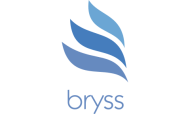

# Bryss Framework



Bryss is a PHP micro framework that helps you quickly write simple yet powerful RESTful APIs inspired by Express and Slim (read the source code by heart). Bryss is built from ground up and no dependencies used currently.

* This is still in its early development used with care *

## Installation

It's recommended that you use [Composer](https://getcomposer.org/) to install Bryss.

```bash
$ composer require citguru/bryss:dev-master
```
*This project is still in development and no stable version yet. You can install by using the :dev-master tag. You should be able to install without it once there's a stable release*

This will install Bryss. Bryss have supports for PHP version from 5.3.0 to the latest ones.

You can also clone this repo directly to your project folder and require the needed classes.


## Usage

Simple HelloWorld impelmentation of Bryss Framework.

```php
<?php

// public/index.php

use Bryss\App;

require __DIR__ . '/../vendor/autoload.php';

$app = App::create();


$app->get("/hello", function($req, $res){
    return $res->json(array(
        "message"=>"Hello World"
    ));
});

$app->get('/hello-xml', function($req, $res, $args) {
  return $res->xml(array(
    "message" => "Hello World",
    "author" => "Ilori Stephen A <stephenilori458@gmail.com>"
  ));
});

$app->get("/hello/:name", function($req, $res){
    $name = $req->params["name"];
    return $res->json(array(
        "message"=>"Hello World, ".$name
    ), 201);
});
?>
```

You can quickly test this using the built-in PHP server:

```bash
$ php -S localhost:8000 -t public
```

Going to http://localhost:8000/hello/, http://localhost:8000/hello-xml/ or http://localhost:8000/hello/:name would return:

```json
{
    "message": "Hello World"
}
```

```xml
<root>
  <message>Hello World</message>
  <author>Ilori Stephen A <stephenilori458@gmail.com></author>
</root>
```

```json
{
    "message": "Hello World, <name>"
}
```

## Deployment

If you have Apache/Nginx and PHP setup either on your own server or shared hosting, you can easily use `.htaccess` to route all requests to an entry file which is usually `index.php`.

```
RewriteEngine on
RewriteCond %{REQUEST_FILENAME} !-f
RewriteCond %{REQUEST_FILENAME} !-d
RewriteRule ^(.*)$ /index.php?path=$1 [NC,L,QSA]
```

or

```
<IfModule mod_rewrite.c>
   RewriteEngine on
   RewriteRule ^$ public/ [L]
   RewriteRule (^[^/]*$) public/$1 [L]
</IfModule>
```

This means you would need to upload your Bryss project and all other files to the `public` or any folder you want (you will need to switch it out in the htaccess) to use. You will probably use FTP to upload it.

## Documentation

Coming soon... For the main time kindly check [public/index](public/index.php) for how to use it.

## Contributions

Please see [CONTRIBUTION](CONTRIBUTION.md) for details.

## Security

If you discover security related issues, please email me : oyetoketoby80@gmail.com

## License

Copyright (c) 2020 Oyetoke Toby (twitter: @oyetokeT)

The Bryss Framework is licensed under the MIT license. See [License File](LICENSE.md) for more information.
